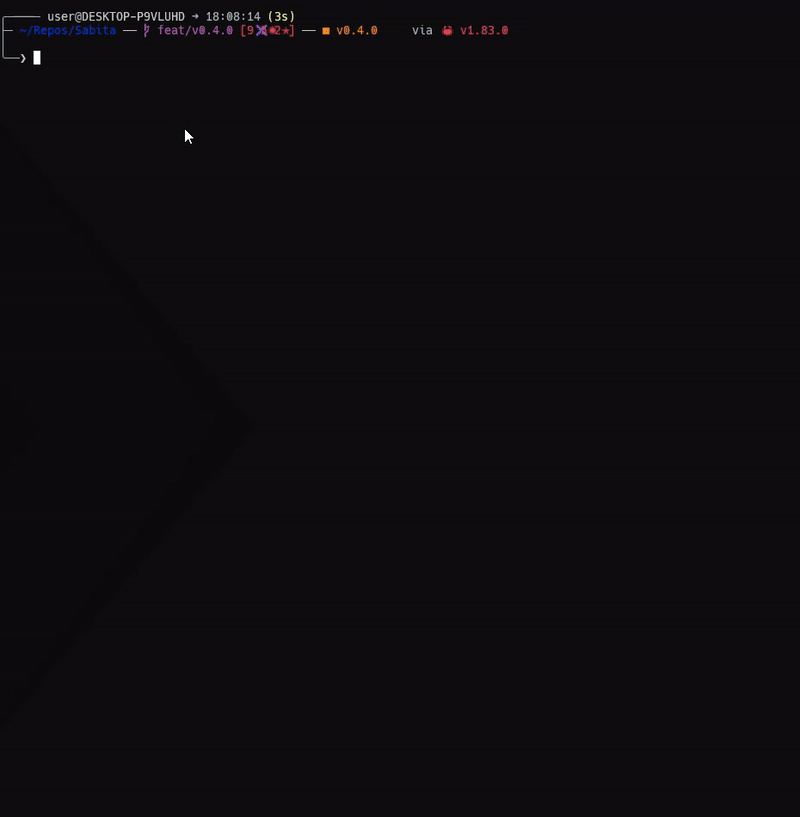

# Perfos


Benchmark parts of your Rust code with stats insights



## Install

```sh
cargo add perfos
```

### Use

In this example, we are benchmarking the [Sabita](https://github.com/MikyStar/Sabita) package which aims to generate and solve Sudokus

```rs
use perfos::{
    benchmark::{benchmark, Config},
    file::FilePolicy,
    runner::BenchmarkFunction,
    time
};

use sabita::core::Grid;

use std::time::Duration;

////////////////////////////////////////

fn get_perfs() {
    let version = env!("CARGO_PKG_VERSION");
    let file_path = format!("benchmarks/v{version}.benchmark");

    benchmark(Config {
        file_path: Some(file_path),
        default_file_policy: Some(FilePolicy::Rewrite),
        nb_buckets_around_avg: 5,
        nb_iterations: 50,
        functions: vec![
            BenchmarkFunction {
                name: "generate".to_string(),
                f: Box::new(benchmark_one_generate),
            },
            BenchmarkFunction {
                name: "solv10".to_string(),
                f: Box::new(solv_10),
            },
        ],
    });
}

////////////////////

fn benchmark_one_generate() -> Duration {
    // We want to know the time taken by the "generate" function
    time!(|| Grid::generate(None))
}

// We want to know the time taken by the "solve" function when 10 values are missing
fn solv_10() -> Duration {
    // First we generate a sudoku with 10 values missing (this step won't be timed)
    let mut grid = Grid::generate(None);
    grid.remove_random_values(10);

    // And now we actually time the "solve" function
    time!(|| grid.solve())
}
```

The code above will generate this benchmark report file

```txt
Benchmarking sabita@v0.3.0 with 50 iterations

┌──────────┬──────────────────┬─────────────────┬─────────────┬─────────────────┐
│ Function │ Average          │ Slowest         │ Fastest     │ Std dev         │
├──────────┼──────────────────┼─────────────────┼─────────────┼─────────────────┤
│ generate │ 30ms 513µs 978ns │ 319ms 484µs 68+ │ 231µs 188ns │ 71ms 444µs 554+ │
│  solv10  │    34µs 567ns    │    83µs 18ns    │ 25µs 370ns  │   11µs 174n     │
└──────────┴──────────────────┴─────────────────┴─────────────┴─────────────────┘

generate

231µs 188ns - 6ms 287µs 746ns         │ ████████████████████████████████████ 64%
6ms 287µs 746ns - 12ms 344µs 304ns    │ █████ 10%
12ms 344µs 304ns - 18ms 400µs 862ns   │ ███ 6%
18ms 400µs 862ns - 24ms 457µs 420ns   │ ███ 6%
24ms 457µs 420ns - 30ms 513µs 978ns   │ 0%
─── Average 30ms 513µs 978ns          ├────────────────────
30ms 513µs 978ns - 88ms 308µs 118ns   │ ██ 4%
88ms 308µs 118ns - 146ms 102µs 258ns  │ 0%
146ms 102µs 258ns - 203ms 896µs 398ns │ ██ 4%
203ms 896µs 398ns - 261ms 690µs 538ns │ ██ 4%
261ms 690µs 538ns - 319ms 484µs 678ns │ █ 2%

solv10

25µs 370ns - 27µs 209ns │ ██████████████████████████████████████████████████ 32%
27µs 209ns - 29µs 48ns  │ █████████████████████████ 16%
29µs 48ns - 30µs 887ns  │ ███████████████ 10%
30µs 887ns - 32µs 726ns │ ██████████████████ 12%
32µs 726ns - 34µs 565ns │ 0%
─── Average 34µs 567ns  ├───────────────────────────
34µs 567ns - 44µs 257ns │ ███ 2%
44µs 257ns - 53µs 947ns │ ████████████████████████████████████████ 26%
53µs 947ns - 63µs 637ns │ 0%
63µs 637ns - 73µs 327ns │ 0%
73µs 327ns - 83µs 17ns  │ ███ 2%
```

### Git hooks

Git hooks are handled with [rusty-hook](https://github.com/swellaby/rusty-hook), to enable them after a fresh install, run `cargo build`

### Tasks

Using [CLI-Manager](https://github.com/MikyStar/CLI-Manager) for task handling.
